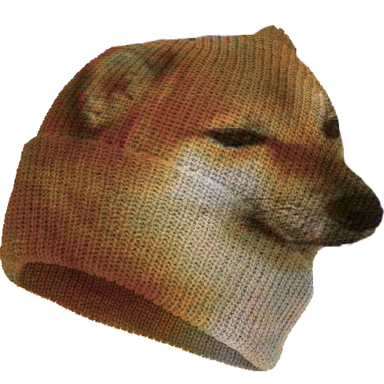
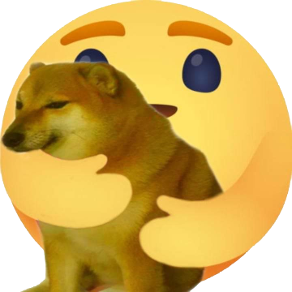
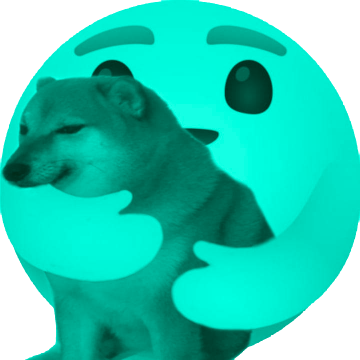
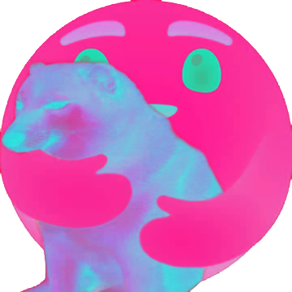

 MIMUW-Hats
=======
MIMUW-hats is a project meant to help fight against the plague of hats and other items lost in the MIMUW building. It will incorporate novel solutions such as Machine Learning, REST APIs and responsive web design to tackle this issue.
 
https://mimuw-hats.herokuapp.com/
##  Software Architecture Introduction

The project provides a web app which allows users to post found hats as well as report their finds.     The system will automatically match images and/or textual descriptions, notifying the owners of the lost items. There will be the option to register their hats to be automatically matched if they are found. There will also be an element of gamification by means of awarding productive users with experience points as well as a very simple feed for viewing, bumping and reacting to posts about lost and found items. The project can also be modified to suit current market demand, for example handling face masks in addition to hats.

##  Technical Details

The project will be composed of three major parts: a responsive web client interface written in React, a REST API backend utilizing Express.js and Node.js, and Machine Learning infrastructure built with Keras in Python.

### Frontend
The frontend will be based on React.js version 16. It will be responsive and function both on mobile and desktop.

### Backend
The backend will be entirely REST-based, including authentication. All HTML rendering will be done client-side in React. A SQLite relational database coupled with TypeORM will be used for persistence.
   
Authentication will be done with JWT. In order to limit the app’s usage to MIMUW students, a MIMUW email address will be connected to each account (Nodemailer).
   
Notification of users will primarily be done by email and push notification done with web-push library.

### Machine Learning
We will use convolutional neural networks (CNNs) to solve the problem of detecting hats in pictures. To be more specific, our neural network (NN) will be able to find bounding box of potential hat. Currently there is used MobileNet (https://arxiv.org/abs/1704.04861). If increased detail is needed, we will move to another type of CNN, namely the YOLO v3 (https://arxiv.org/abs/1804.02767) model from the well-known scientific article. 
   
The implementation will be carried out in keras 2.3.1 (python3) in a version with tensorflow 2.0 backend. We don't have 100% certainty about NN correctness. If prediction fails, posts can be still verified by moderators.
For rapid testing, Proofs-of-Concept (PoC-s) provided by the fast.ai
library will be used.
   
Datasets come from two sources: 1) photos from MIMUW groups on
Facebook about missing things 2) scraping Google images using simple
scripts (in JavaScript and Python). Dataset size will be about n 10k <=
100k images.
   
Due to the complexity of the problem, the training will take place on
Google Colab - the free version gives access to NVIDIA Tesla K80, P4,
T4, P100, and V100 GPUs (Google Colab assigns specific models
without the possibility of choosing them by us).

##  Additional constraints

### Security – Moderation
To limit malicious usage, each account will be linked to a MIMUW email
by sending a confirmation. The system will automatically detect posts not
related to hats. Users designated as moderators will have the ability to
delete inappropriate posts not detected by the system as well as allow
posts flagged by mistake.
### Speed
Since information is sent to users mostly by notification, speed of
matching items does not have to be very high. Notifying a user of their
image being removed due to being inappropriate should be reasonably
fast as to provide a better user experience.
### User rewards
User participation will be encouraged by awarding active players with
experience points. When accumulated, they will allow users to gain
ranks. Ranks will be named by MIMUW courses according to their
difficulty, e.g. Rank 1 - PO, Rank 5 - MD, Rank 10 - WPI.
